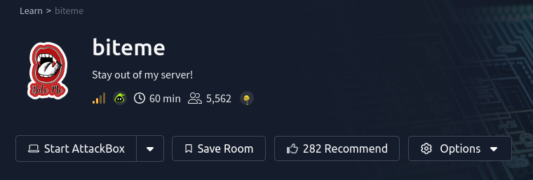

# Biteme[Tryhackme]
__Biteme Tryhackme room, difficulty ***Meduim***__
- access room through this link [Biteme](https://tryhackme.com/room/biteme)
<p align="center">
  
</p>

## Recon
initially we can use ***Nmap*** to discover open 
ports and services running in the web app
```bash 
nmap -Pn -sV -T4 biteme.thm | tee nmap_result
```
after scanning we got 2 open ports 
_ 22 for OpenSSH
_ 80 for https
```
Nmap scan report for biteme.thm (10.114.189.44)
PORT   STATE SERVICE VERSION
22/tcp open  ssh     OpenSSH 8.2p1 Ubuntu 4ubuntu0.13 (Ubuntu Linux; protocol 2.0)
80/tcp open  http    Apache httpd 2.4.41 ((Ubuntu))
Service Info: OS: Linux; CPE: cpe:/o:linux:linux_kernel
Nmap done: 1 IP address (1 host up) scanned in 10.67 seconds
```


