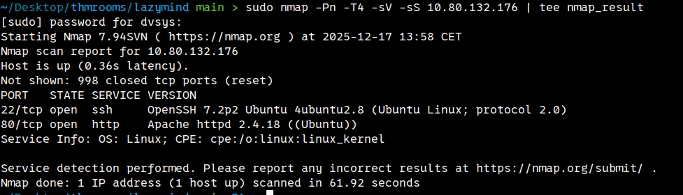

# notes LazyAdmin

## recon
#### Nmap result

we notice by the following output the server use **ssh** and **ubutu** server
#### Content Discovery
``` ffuf -u http://TARGET_MACHINE/FUZZ -w /path/wordlist ```
- ffuf output after we do directory enumeration we notice that we get output 

- let's try visit the web page ```http://TARGET_MACHINE/content```


